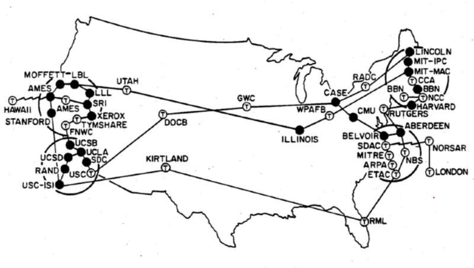
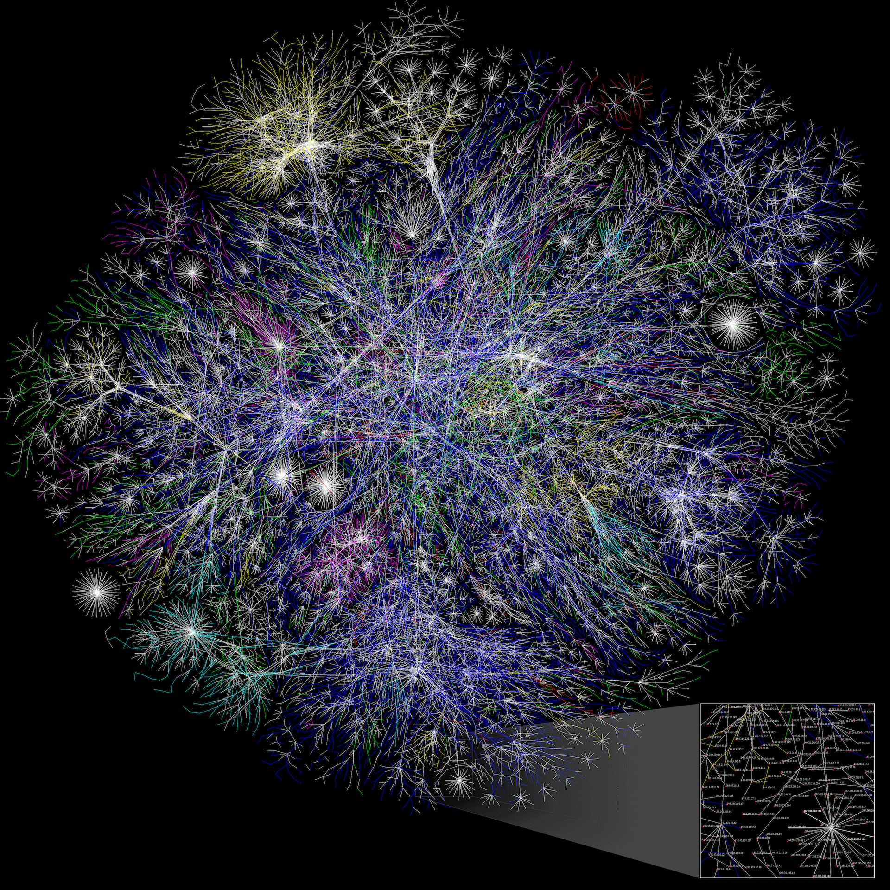
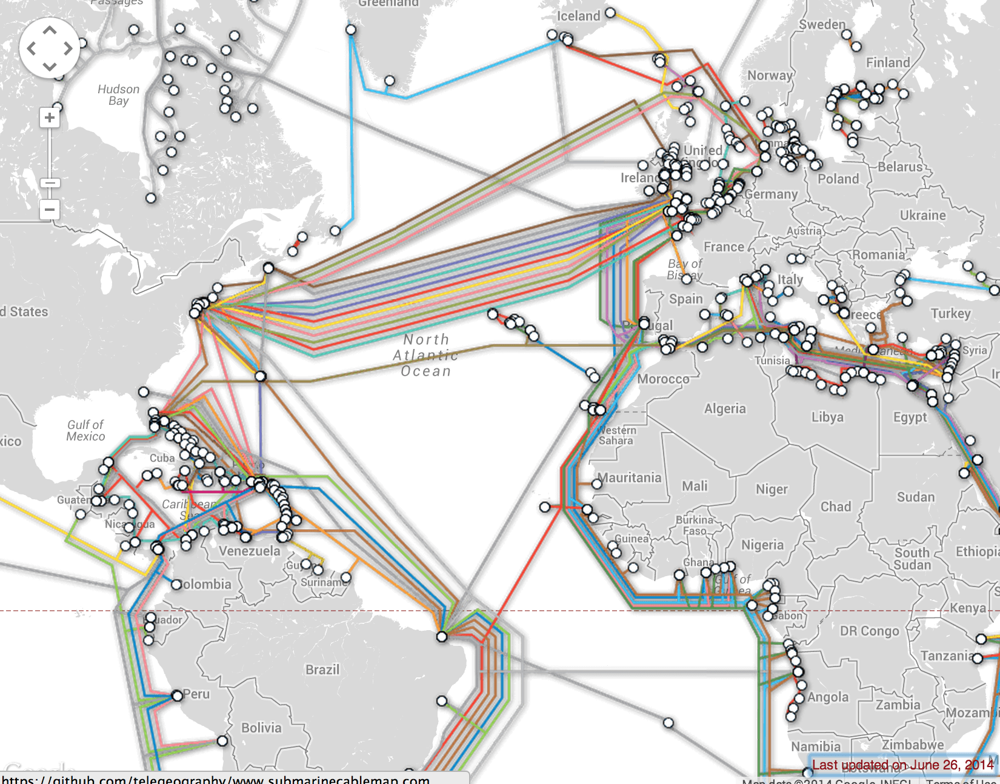

# How the Internet works

We bet you use the Internet every day. But do you actually know what happens when you type an address like https://djangogirls.org into your browser and press `enter`?

The first thing you need to understand is that **a website consists of a bunch of files saved on a hard disk** -- just like your movies, music, or pictures.
However, there is one part that is unique for websites: they include computer code called HTML.

If you're not familiar with programming, it can be hard to grasp HTML at first, but your web browsers (like Chrome, Safari, Firefox, etc.) love it. **Web browsers are designed to understand this code,
follow its instructions, and present these files that your website is made of, exactly the way you want.**

As with every file, we need to store HTML files somewhere on a hard disk. For the Internet, we use special, powerful computers called ***servers***. They don't have
a screen, mouse or a keyboard, because **their main purpose is to store data and serve it. That's why they're called *servers* – because they *serve* you data.**

OK, but you want to know how the Internet looks, right?

Here's what the Internet (also called the ARPANet) looked in the early days:

And, here's how the Internet looked like in 2005!

_(click the image to see a full-size version)_ / [_source_](https://commons.wikimedia.org/wiki/File:Internet_map_4096.png)

Each line is drawn between two ***nodes*** (computers connected to the network), representing two IP addresses.

And, here's a closeup of that map where each node is accompanied by its IP address.

Looks like a mess, right? In fact **it is a network of connected machines (the above-mentioned *servers*). Hundreds of thousands of machines!** Many, many kilometers of cables around the world! You can visit a Submarine Cable Map website (http://submarinecablemap.com) to see how complicated the net is. Here is a screenshot from the website:

It is fascinating, isn't it? But it is not possible to have a wire between every machine connected to the Internet. So, to reach a machine (for example, the one where https://djangogirls.org is saved) we need to pass a request through many, many different machines.

It looks like this:

Imagine that when you type https://djangogirls.org, you send a letter that says: "Dear Django Girls, I want to see the djangogirls.org website. Send it to me, please!"

Your letter goes to the post office closest to you. Then it goes to another that is a bit nearer to your addressee, then to another, and another until it is delivered at its destination. The only unique thing is that if you send many letters (***data packets***) to the same place, they could go through totally different post offices (***routers***). This depends on how they are distributed at each office.

That's how it works - you send messages and you expect some response. Instead of paper and pen you use bytes of data, but the idea is the same!

Instead of addresses with a street name, city, zip code and country name, we use **IP addresses**. Your computer first asks the **DNS (Domain Name System)** to translate `djangogirls.org` into an IP address. **DNS works a little bit like old-fashioned phonebooks** where you can look up the name of the person you want to contact and find their phone number and address.

When you send a letter, it needs to have certain features to be delivered correctly: an address, a stamp, etc. You also use a language that the receiver understands, right? The same applies to the *data packets* you send to see a website. We use a protocol called **HTTP** (Hypertext Transfer Protocol).

So, basically, when you have a website, you need to have a *server* (machine) where it lives. When the *server* receives an incoming ***request*** (in a letter), it sends back your website as a ***response*** (in another letter).

---

This content is based on the [How the Internet works](https://tutorial.djangogirls.org/en/how_the_internet_works/) tutorial, created and maintained by [Django Girls](https://djangogirls.org/en/). The original source code can be found [here](https://github.com/DjangoGirls/tutorial/tree/master/en/how_the_internet_works). If you found this resource helpful, **please consider adding a star** on these 2 GitHub repositories as a token of your appreciation: [Django Girls Tutorial](https://github.com/DjangoGirls/tutorial/tree/master) / [WDX-180](https://github.com/in-tech-gration/WDX-180).

---

Copyright 2023 Intechgration.io

This post is licensed under the GNU General Public License version 3 (GPLv3).
